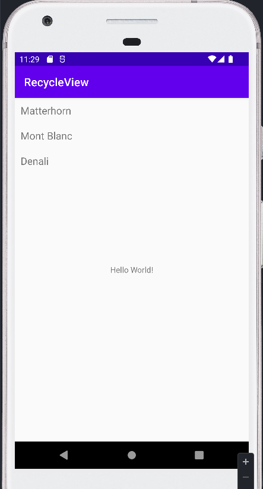
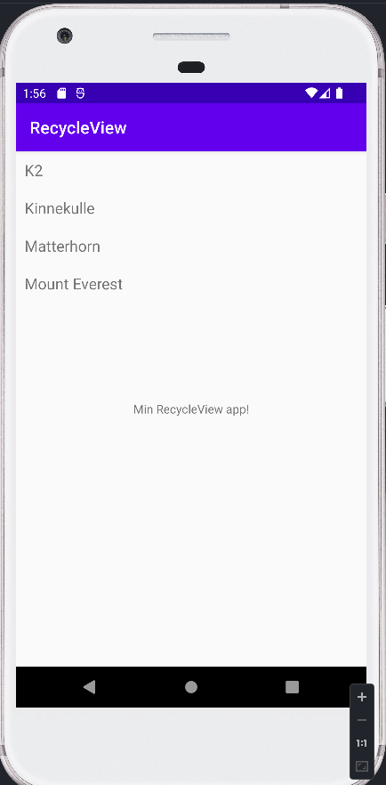

# Networking / RecycleView
## Rapport

I denna uppgift har jag skapat en app som hämtar data om olika berg från en webbtjänst och visar upp den i appen med hjälp av en recycleview.

Först av allt forkade jag repo från Github och klonade jag det till min dator så jag kan öppna det i Android Studio. Det första jag gjorde i Android Studio var att ändra namn på appen från "Networking" till "RecycleView".
När det var gjort lade jag till en RecycleView widget på MainActivity.java. 
Efter det implementerade jag den koden som finns på LenaSYS så att den funkar tillsammans med mitt projekt. För att se om RecycleView fungerar fick varje RecycleItems ett tilldelat namn. Detta kommer ändras i nästa steg när vi hämtar JSON data.
Ett problem som uppstod var att appen vägrade starta. Detta var pågrund av att build.gradle filen som hämtas från Github är utdaterad för den senaste versionen av Android Studio. Jag fick gå in i build.gradle för att ändra minSdkVersion från 19 till 24 för att få appen att starta.
Efter att problemet var löst fick jag nu upp de tre placeholder-bergen i min recycleview
 // Färdig recycleview utan JSON

Nu när min RecycleView var färdig kunde jag fokusera på hämtningen av JSON data. Först skapade jag en ny class Mountain.java där alla variabler designeras med datans attribut.
Sedan i MainActivity ändrade jag koden så att den kan ta emot JSON datan och visa det i RecycleView listan. Först av allt bytte jag ut placeholder texten för JSON_URL till URL-länken till webbtjänsten så att den vet varifrån den ska hämta datan. Sedan tog jag bort placeholder datan som lades till för RecycleItems så att de kan hantera JSON datan.
Sen skapade jag en for-loop som itererar för varje berg som hämtas blir ett item i listan. Detta gör att de fyra bergen som finns i webbtjänsten skrivs ut i RecycleView listan.
